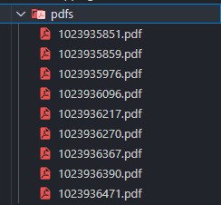

# DIAN RUT Web Scraper

## Overview

This project is a web scraper designed to efficiently retrieve data from a website using multiprocessing to speed up the process. The scraper is built using Python, Selenium for browser automation, and Pillow for taking screenshots and saving them as PDFs.

## Table of Contents

1. [Features](#features)
2. [Prerequisites](#prerequisites)
3. [Setup Instructions](#setup-instructions)
4. [Usage](#usage)
5. [Contributing](#contributing)
6. [Disclaimer](#disclaimer)

## Features

- Efficient data retrieval using multiprocessing
- Browser automation with Selenium
- Screenshot capture and PDF generation with Pillow

## Prerequisites

- Python 3.x
- Google Chrome or Firefox
- ChromeDriver or GeckoDriver

## Setup Instructions

1. **Clone the repository:**

    ```sh
    git clone https://github.com/Tavo17s/dian_rut_scraper.git
    cd dian_rut_scraper
    ```

2. **Create and activate a virtual environment:**

    ```sh
    python3 -m venv venv
    source venv/bin/activate  # On Windows use `venv\Scripts\activate`
    ```

3. **Install dependencies:**

    ```sh
    pip install -r requirements.txt
    ```

4. **Download the appropriate WebDriver:**

    - [ChromeDriver](https://sites.google.com/a/chromium.org/chromedriver/downloads)
    - [GeckoDriver](https://github.com/mozilla/geckodriver/releases)

## Usage

1. **Fill the data.csv file:** 

2. **Run the web scraper:**

    ```sh
    venv/bin/python dian_scraper_multi.py  # On Windows use venv\Scripts\python dian_scraper_multi.py
    ```

3. **Screenshots and data will be saved in the `pdfs` directory as PDFs.**



## Benchmark

To demonstrate the performance improvement using multiprocessing, here is a comparison of execution times for single-threaded vs. multi-threaded scraping:
Single-threaded Execution


    Total items scraped: 10
    Execution time: 19.89 seconds


Multi-threaded Execution

    Number of workers: 10
    Total items scraped: 100
    Execution time: 42.25 seconds


The multiprocessing implementation reduces the execution time significantly by parallelizing the data retrieval process.

## Contributing

1. Fork the repository.
2. Create a new branch: `git checkout -b my-new-feature`.
3. Make your changes and commit them: `git commit -m 'Add some feature'`.
4. Push to the branch: `git push origin my-new-feature`.
5. Submit a pull request.

## Disclaimer

This project is for educational and demonstrative purposes only. The author does not own the website being scraped, and the project should not be used for any commercial or malicious purposes. Use this tool responsibly and ensure that your use complies with the terms of service of the website being scraped.
